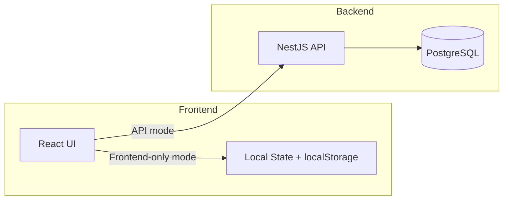
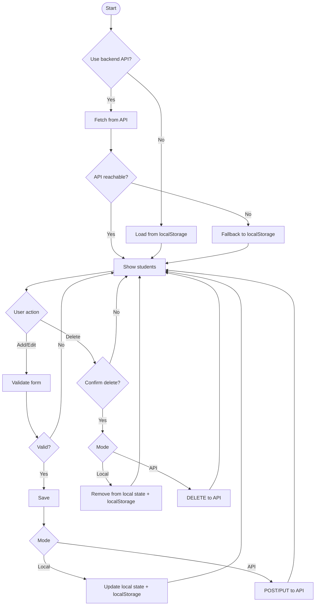

# Students Table

## Project Overview
Students Table is a dual-mode application that supports frontend-only CRUD (in-memory + localStorage) and a full backend API powered by NestJS and PostgreSQL. It is designed to satisfy assignments that require both a standalone frontend and a real database-backed backend.

## Specifications

### Frontend (React + Vite)
- Student list columns: Name, Email, Age, Actions (Edit/Delete)
- Add Student form with validation (all fields mandatory, valid email format)
- Edit Student with pre-filled data and same validation rules
- Delete Student with confirmation dialog
- Simulated loading state
- Excel download for filtered rows or full dataset
- Frontend-only CRUD using local state/localStorage
- Optional toggle to use backend API when available

### Backend (NestJS + PostgreSQL)
- CRUD REST endpoints for students
- Validation for name, email, age
- PostgreSQL persistence
- CORS support for frontend
- Consistent response shape: `{ data, meta }`

## Architecture Diagram

## Flowchart

